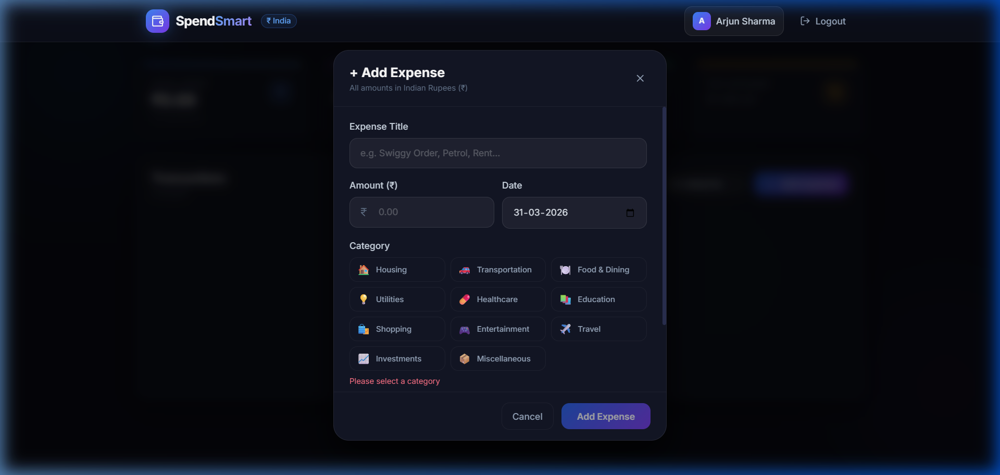

<p align="center">
  
  
  
</p>

<h1 align="center">💰 SpendSmart — Expense Tracker</h1>
<p align="center">
  <strong>A modern, full-stack MERN Expense Tracker with dark glassmorphism UI, animated charts, and Indian Rupee (₹) support.</strong>
</p>
<p align="center">
  Built with MongoDB · Express.js · React (Vite) · Node.js · TailwindCSS · Recharts
</p>

<p align="center">
  <a href="https://mern-expanse-tracker-production.up.railway.app/login" target="_blank">
    
  </a>
</p>

---

## 📸 Screenshots

### 🔐 Authentication
| Login | Sign Up |
|:---:|:---:|
|  |  |

### 📊 Dashboard — Overview


### 📈 Analytics — Charts & Graphs


### 🔍 Advanced Filters


### ➕ Add Expense Modal


---

## ✨ Features

### Core Functionality
- ✅ **User Authentication** — JWT-based signup & login with bcrypt password hashing
- ✅ **CRUD Operations** — Create, Read, Update, Delete expenses
- ✅ **MongoDB Database** — Cloud-hosted on MongoDB Atlas via Mongoose ODM
- ✅ **RESTful API** — Express.js backend with protected routes
- ✅ **Per-user Isolation** — Each user sees only their own expenses
- ✅ **Account Security** — Secure password changing and permanent account deletion
- ✅ **Recovery Flow** — Email-based password reset for forgotten credentials
- ✅ **Email Notifications** — OTP verification for registration (NodeMailer)

### Dashboard & Analytics
- 📊 **3-Tab Dashboard** — Overview, Analytics, Transactions
- 📈 **5 Chart Types** — Area chart, Bar chart, Line chart, Donut/Pie chart, Progress bars (via Recharts)
- ⏱️ **4 Period Views** — Daily, Weekly, Monthly, Yearly with one-click switching
- 📅 **Advanced Date Filters** — Custom date range picker, month/year selector, 10 quick presets
- 🔎 **Multi-Filter Panel** — Category, amount range (min/max), sort order (6 options), keyword search
- 🏷️ **Active Filter Chips** — Visual chips with individual remove buttons
- 📉 **Period Comparison** — vs previous period with ↑↓ percentage change
- 🎯 **Animated Counters** — Numbers count up with easing animation

### UI/UX Design
- 🌑 **Dark Glassmorphism** — Premium dark theme with blurred glass cards
- ✨ **Particle Background** — 60 floating connected particles via Canvas API
- 🌈 **Animated Mesh Gradient** — Shifting radiant background with grid overlay
- 🔮 **3 Floating Orbs** — Blue, violet, cyan orbs with parallax float animations
- 💫 **Micro-animations** — Hover lifts, shimmer buttons, staggered row entries
- 🇮🇳 **Indian Rupee (₹)** — All amounts formatted with `en-IN` locale
- 📱 **Responsive** — Works on desktop, tablet, and mobile
- 🎨 **11 Expense Categories** — With emoji icons and color-coded badges

---

## 🛠️ Tech Stack

| Layer | Technology |
|-------|-----------|
| **Frontend** | React 18 (Vite), TailwindCSS, Recharts, Lucide Icons, Axios |
| **Backend** | Node.js, Express.js |
| **Database** | MongoDB Atlas (Mongoose ODM) |
| **Auth** | JWT (JSON Web Tokens), bcryptjs |
| **Styling** | TailwindCSS + Custom CSS (glassmorphism, animations) |

---

## 📁 Project Structure

```
MERN FULL STACK PROJECT/
├── backend/
│   ├── middleware/
│   │   └── auth.js              # JWT authentication middleware
│   ├── models/
│   │   ├── User.js              # User schema (username, email, password)
│   │   └── Expense.js           # Expense schema (title, amount, category, date)
│   ├── routes/
│   │   ├── auth.js              # POST /signup, POST /login
│   │   └── expenses.js          # CRUD: GET, POST, PUT, DELETE /expenses
│   ├── .env                     # Environment variables (gitignored)
│   ├── package.json
│   └── server.js                # Express entry point + MongoDB connection
│
├── frontend/
│   ├── src/
│   │   ├── components/
│   │   │   ├── Navbar.jsx           # Glassmorphism navigation bar
│   │   │   ├── ExpenseForm.jsx      # Modal form with emoji category grid
│   │   │   └── ParticleBackground.jsx # Canvas particle network animation
│   │   ├── context/
│   │   │   └── AuthContext.jsx      # Global auth state (JWT + user)
│   │   ├── pages/
│   │   │   ├── Login.jsx            # Login page
│   │   │   ├── Signup.jsx           # Signup page with feature pills
│   │   │   ├── Dashboard.jsx        # Main dashboard (3 tabs, charts, filters)
│   │   │   ├── Profile.jsx          # Security settings and account management
│   │   │   ├── ForgotPassword.jsx   # Password reset request flow
│   │   │   └── ResetPassword.jsx    # Reset password entry point
│   │   ├── api.js                   # Axios instance with JWT interceptor
│   │   ├── App.jsx                  # Router + animated background layers
│   │   ├── main.jsx                 # React entry point
│   │   └── index.css                # Global styles (glassmorphism, animations)
│   ├── tailwind.config.js
│   ├── postcss.config.js
│   ├── vite.config.js
│   └── package.json
│
├── screenshots/                 # Preview images for README
└── README.md
```

---

## 🚀 Getting Started

### Prerequisites
- **Node.js** v18+ and **npm**
- **MongoDB Atlas** account (or local MongoDB)

### 1. Clone the Repository
```bash
git clone https://github.com/YOUR_USERNAME/spendsmart-expense-tracker.git
cd spendsmart-expense-tracker
```

### 2. Backend Setup
```bash
cd backend
npm install
```

Create a `.env` file in `backend/`:
```env
PORT=5000
MONGO_URI=mongodb+srv://<username>:<password>@cluster.mongodb.net/<dbname>
JWT_SECRET=your_jwt_secret_key_here
```

Start the backend:
```bash
npm start
```

### 3. Frontend Setup
```bash
cd frontend
npm install
npm run dev
```

### 4. Open in Browser
```
http://localhost:5173
```

---

## 📡 API Endpoints

### Auth Routes (`/api/auth`)
| Method | Endpoint | Description | Auth |
|--------|----------|-------------|------|
| POST | `/api/auth/signup` | Register new user | ❌ |
| POST | `/api/auth/login` | Login & get JWT token | ❌ |

### Expense Routes (`/api/expenses`)
| Method | Endpoint | Description | Auth |
|--------|----------|-------------|------|
| GET | `/api/expenses` | Get all user expenses | ✅ |
| POST | `/api/expenses` | Create new expense | ✅ |
| PUT | `/api/expenses/:id` | Update an expense | ✅ |
| DELETE | `/api/expenses/:id` | Delete an expense | ✅ |

---

## 📊 Expense Categories

| Emoji | Category | Color |
|:---:|---|---|
| 🏠 | Housing | Blue |
| 🚗 | Transportation | Violet |
| 🍽️ | Food & Dining | Amber |
| 💡 | Utilities | Cyan |
| 💊 | Healthcare | Red |
| 📚 | Education | Green |
| 🛍️ | Shopping | Pink |
| 🎮 | Entertainment | Orange |
| ✈️ | Travel | Teal |
| 📈 | Investments | Lime |
| 📦 | Miscellaneous | Gray |

---

## 🔐 Environment Variables

| Variable | Description |
|----------|-------------|
| `PORT` | Backend server port (default: 5000) |
| `MONGO_URI` | MongoDB Atlas connection string |
| `JWT_SECRET` | Secret key for JWT token signing |

---

## 👨‍💻 Author

Built as a MERN Full-Stack Web Development project.

---

## 📄 License

This project is licensed under the [MIT License](LICENSE).
