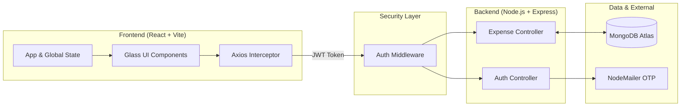
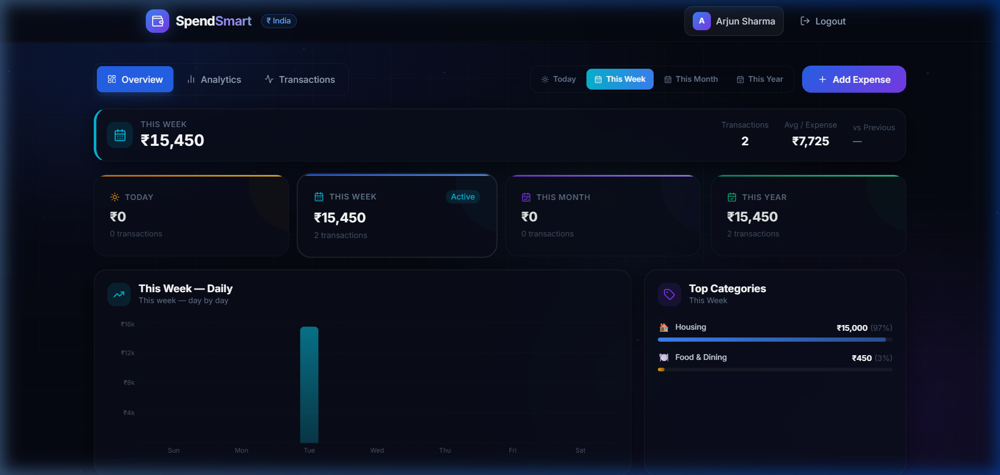
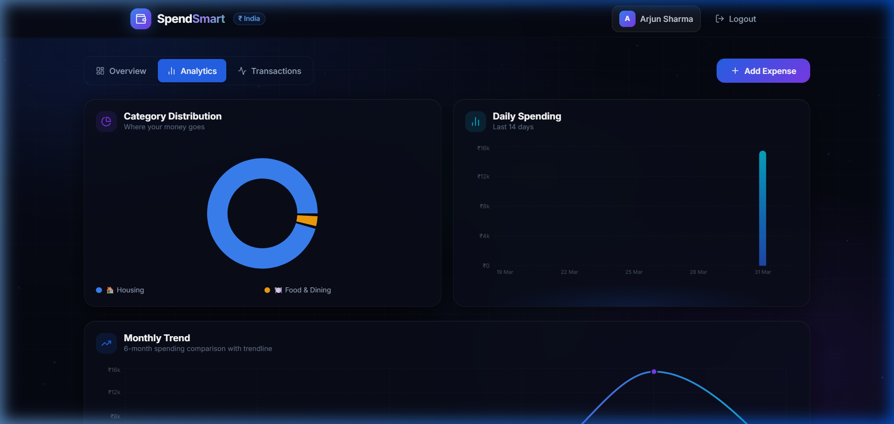
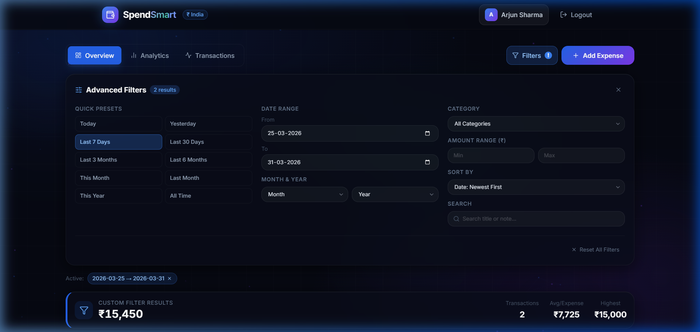
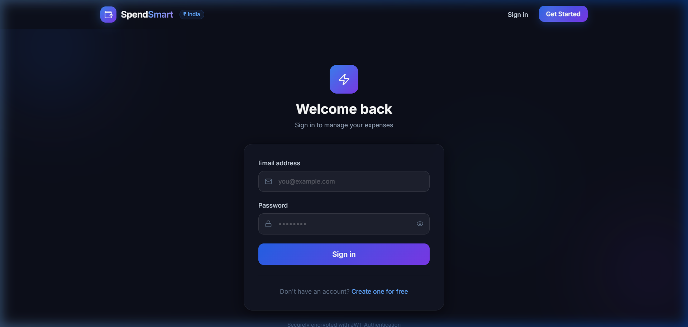
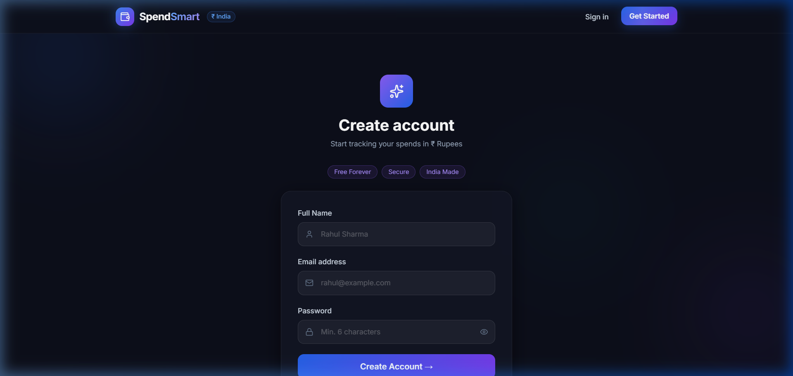

<p align="center">
  
  
  
  
  
</p>

<h1 align="center">💰 SpendSmart — Expense Tracker</h1>
<p align="center">
  <strong>A high-performance, full-stack financial ecosystem with glassmorphism UI and real-time analytics.</strong>
</p>

<p align="center">
  <a href="https://mern-expanse-tracker-production.up.railway.app/login" target="_blank">
    
  </a>
</p>

---

## 🏗️ System Architecture

SpendSmart follows a robust **MERN Stack** architecture designed for security, scalability, and responsiveness.



---

## ✨ Engineering Excellence

SpendSmart goes beyond simple CRUD operations to deliver a production-ready financial tool.

### 📊 Data Intelligence
- **Recharts Visualization** — Dynamic calculation and rendering of spending patterns at 60fps.
- **Multi-Period Switching** — Real-time period shifting (**Daily, Weekly, Monthly, Yearly**) with instant re-calculations.
- **Deep Filtering** — Multi-index search across categories, amount ranges, and custom date windows.

### 🌑 Premium UX Design
- **Glassmorphism UI** — High-performance blur effect cards with `backdrop-filter`.
- **Canvas Particles** — Animated particle network that interacts with mouse positions.
- **Responsive & Accessible** — Mobile-first design that adapts seamlessly to any screen size.

### 🔐 Enterprise Security
- **JWT Authentication** — Stateless auth with secure token management.
- **BCrypt Encryption** — Passwords are hashed with 10 salt rounds.
- **OTP Verification** — 6-digit email verification required for all new registrations.
- **Password Recovery** — Secure email link recovery using `crypto.randomBytes`.

---

## 📸 Project Showcase

### 📊 Comprehensive Dashboard
A bird's-eye view of your finances with glassmorphism cards and real-time expense tracking.


---

### 📈 Advanced Analytics & Multi-Period Insights
Visualize spending patterns using interactive Recharts. Switch between Daily, Weekly, Monthly, and Yearly views with ease.


---

### 🔍 Powerful Transaction Filters
The multi-filter panel allows you to drill down into your data by categories, date ranges, and keywords.


---

### 🔐 Secure Authentication & Account Recovery
Enterprise-grade security featuring JWT, BCrypt hashing, and OTP-based email verification.
| Login Page | Sign Up Page |
|:---:|:---:|
|  |  |

---

## 📂 Project Structure

```bash
MERN FULL STACK PROJECT/
├── backend/
│   ├── middleware/              # JWT verification logic
│   ├── models/                  # Mongoose Schemas (User, Expense)
│   ├── routes/                  # Express Handlers (Auth, Expenses)
│   ├── utils/                   # Shared utilities (NodeMailer)
│   └── server.js                # Database connection & App entry
│
├── frontend/
│   ├── src/
│   │   ├── components/          # Reusable Glass UI & Icons
│   │   ├── context/             # React Context (Auth State)
│   │   ├── pages/               # Functional pages (Dashboard, Profile, Recovery)
│   │   ├── api.js               # Axios global instance
│   │   └── App.jsx              # Main Layout & Animations
│   └── tailwind.config.js       # Custom glassmorphism extensions
└── README.md
```

---

## 🚀 Deployment & Onboarding

### 🛠️ Local Installation
1. **Clone & Install**
   ```bash
   npm install --prefix backend
   npm install --prefix frontend
   ```
2. **Environment Configuration**
   Create `backend/.env`:
   ```env
   PORT=5000
   MONGO_URI=your_atlas_uri
   JWT_SECRET=your_jwt_secret
   EMAIL_USER=your_gmail_id
   EMAIL_PASS=your_app_password
   ```
3. **Run Development Server**
   ```bash
   # Both Backend (5000) and Frontend (5173) must run
   npm start --prefix backend
   npm run dev --prefix frontend
   ```

### 📡 API Documentation

#### 🔐 Auth Endpoints (`/api/auth`)
| Method | Endpoint | Description | Auth |
|---|---|---|---|
| POST | `/register` | Register + Send Email OTP | ❌ |
| POST | `/verify-otp` | Verify OTP & Log In | ❌ |
| POST | `/login` | Standard Email/Pass Login | ❌ |
| POST | `/google` | Google One-Tap Login | ❌ |
| POST | `/forgot-password` | Request Reset Link | ❌ |
| PUT | `/reset-password/:token` | Set New Password | ❌ |
| PUT | `/change-password` | Update Password (Logged-in) | ✅ |
| DELETE| `/profile` | Delete Account & Data | ✅ |

#### 💸 Expense Endpoints (`/api/expenses`)
| Method | Endpoint | Description | Auth |
|---|---|---|---|
| GET | `/` | Fetch all user expenses | ✅ |
| POST | `/` | Create new expense | ✅ |
| PUT | `/:id` | Update existing expense | ✅ |
| DELETE| `/:id` | Remove expense record | ✅ |

---
## 🛠️ DNS Issue & Solution

**Problem:** Users may see the error *“This site can’t be reached – DNS_PROBE_FINISHED_NXDOMAIN”* (or similar DNS resolution errors) when trying to access the deployed application.

**Solution:**

1. **Use a reliable DNS provider** – switch to Google DNS (`8.8.8.8` and `8.8.4.4`) or Cloudflare DNS (`1.1.1.1` and `1.0.0.1`).
2. **Update your domain’s DNS records** – point the A record to the IP address supplied by your hosting service (e.g., Railway, Render). If you are using a custom sub‑domain, ensure the CNAME record points to the correct target.
3. **Allow propagation** – DNS changes can take up to 24 hours to propagate worldwide.
4. **Flush your local DNS cache** – on Windows run `ipconfig /flushdns`; on macOS run `sudo dscacheutil -flushcache; sudo killall -HUP mDNSResponder`; on Linux run `sudo systemd-resolve --flush-caches` or restart the `nscd` service.
5. **Verify the DNS resolution** – use `nslookup yourdomain.com` or `dig yourdomain.com` to confirm the correct IP is returned.

After completing these steps, retry accessing the application. The error should be resolved.


**Problem:** Users may see the error *“This site can’t be reached – DNS_PROBE_FINISHED_NXDOMAIN”* when trying to access the deployed app.

**Solution:** Update your DNS provider to use a reliable DNS service such as **Google DNS (8.8.8.8 / 8.8.4.4)** or **Cloudflare DNS (1.1.1.1)**. After changing the DNS records, allow propagation (up to 24 hours) and clear your local DNS cache (`ipconfig /flushdns` on Windows) before retrying.

**Problem:** Users may encounter a DNS resolution error when accessing the deployed application, resulting in a *ERR_NAME_NOT_RESOLVED* or similar message.

**Solution:** Ensure the custom domain's DNS A record points to the correct IP address provided by the hosting service (e.g., Railway, Render). After updating the DNS records, allow up to 24 hours for propagation, then clear your local DNS cache (`ipconfig /flushdns` on Windows) and retry accessing the app.


## 👨‍💻 Author & Support
**Built with ❤️ for Financial Freedom.**

Developed as a full-stack project focusing on high-performance MERN architecture. If you find this project helpful, give it a ⭐ to show your support!

---

## 📝 License
Licensed under the [MIT License](LICENSE).
